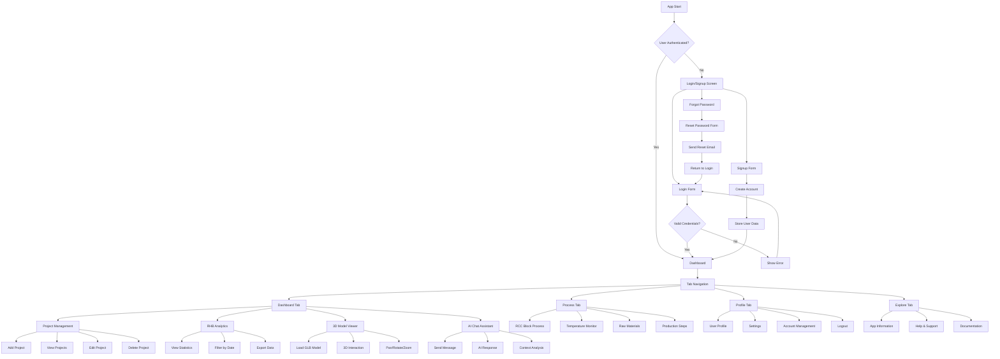
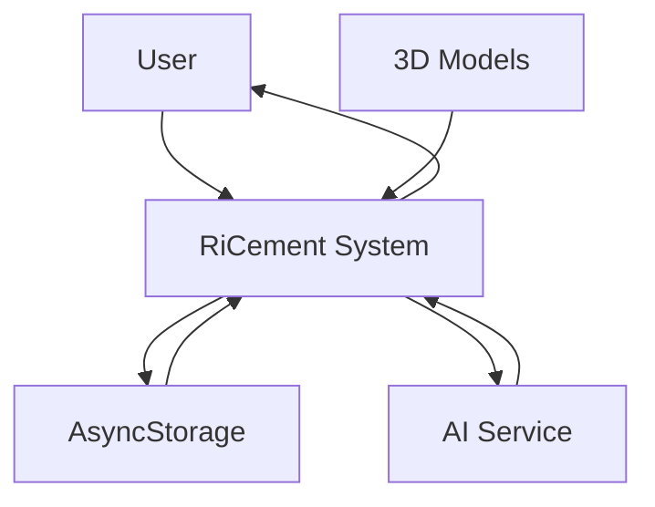
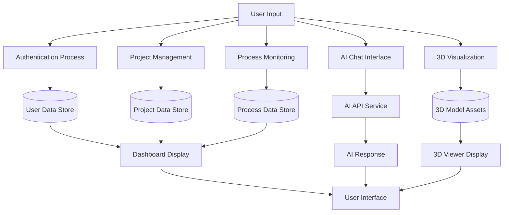
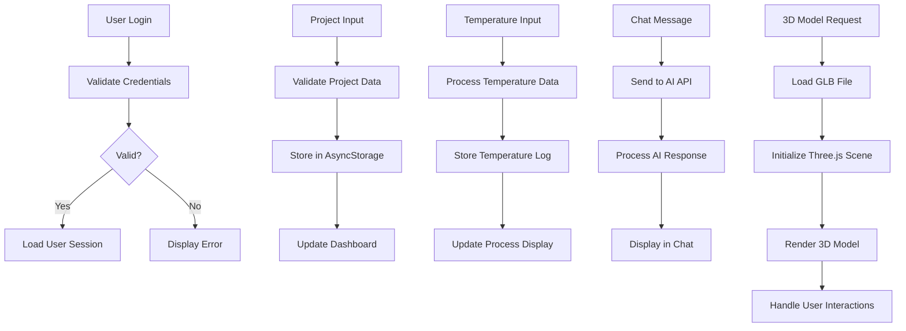
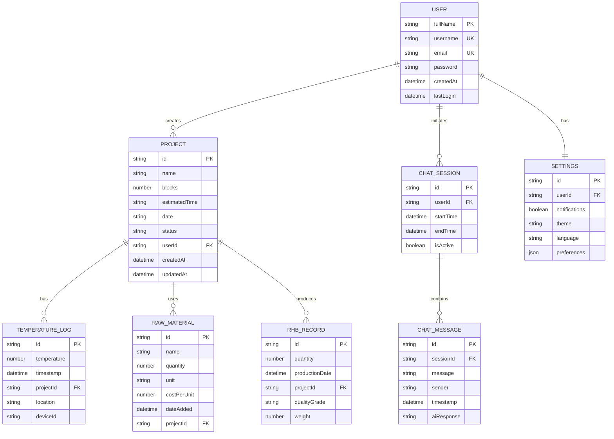

# RiCement App - System Documentation

## 1. FLOW CHART



## 2. DATA FLOW DIAGRAM (DFD)

### Level 0 - Context Diagram


### Level 1 - Process Breakdown


### Level 2 - Detailed Data Flow


## 3. ENTITY RELATIONSHIP DIAGRAM (ERD)



## 4. SYSTEM ALGORITHM

### Main Application Flow Algorithm
```
ALGORITHM: RiCement App Main Flow

BEGIN
    1. Initialize App
        - Load React Native components
        - Initialize navigation router
        - Set up theme context
        - Load AsyncStorage data
    
    2. Authentication Check
        IF user_session EXISTS AND is_valid THEN
            Navigate to Dashboard
        ELSE
            Navigate to Login Screen
        END IF
    
    3. User Authentication Process
        WHILE not authenticated DO
            Display login/signup options
            GET user input (credentials)
            
            IF login_attempt THEN
                VALIDATE credentials
                IF valid THEN
                    CREATE user session
                    STORE session in AsyncStorage
                    Navigate to Dashboard
                ELSE
                    DISPLAY error message
                END IF
            
            ELSE IF signup_attempt THEN
                VALIDATE new user data
                IF valid THEN
                    CREATE new user account
                    STORE user data
                    CREATE user session
                    Navigate to Dashboard
                ELSE
                    DISPLAY validation errors
                END IF
            END IF
        END WHILE
    
    4. Dashboard Operations
        WHILE app is active DO
            SWITCH current_tab:
                CASE "dashboard":
                    EXECUTE dashboard_algorithm()
                CASE "process":
                    EXECUTE process_algorithm()
                CASE "profile":
                    EXECUTE profile_algorithm()
                CASE "explore":
                    EXECUTE explore_algorithm()
            END SWITCH
            
            // Global AI Chat
            IF ai_chat_triggered THEN
                EXECUTE ai_chat_algorithm()
            END IF
        END WHILE
END

ALGORITHM: Dashboard Operations

BEGIN
    1. Load Project Data
        projects = LOAD from AsyncStorage
        DISPLAY project cards
        CALCULATE statistics
    
    2. Project Management
        WHILE user_interaction DO
            SWITCH action:
                CASE "add_project":
                    GET project details from user
                    VALIDATE input data
                    CREATE new project object
                    STORE in AsyncStorage
                    UPDATE display
                
                CASE "edit_project":
                    GET project_id
                    LOAD existing project data
                    GET updated details from user
                    UPDATE project object
                    STORE changes
                    UPDATE display
                
                CASE "delete_project":
                    GET project_id
                    CONFIRM deletion with user
                    IF confirmed THEN
                        REMOVE from AsyncStorage
                        UPDATE display
                    END IF
            END SWITCH
        END WHILE
    
    3. Analytics Processing
        FOR each project in projects DO
            IF project.status == "Completed" THEN
                ADD project.blocks to total_rhb
                CATEGORIZE by date (today/week/month)
            END IF
        END FOR
        
        DISPLAY analytics dashboard
END

ALGORITHM: 3D Model Viewer

BEGIN
    1. Initialize 3D Environment
        CREATE Three.js scene
        SET camera position and properties
        ADD lighting (ambient, directional, point)
        CREATE renderer with proper viewport
    
    2. Load 3D Model
        TRY
            LOAD GLB model from public directory
            PARSE model data
            CALCULATE bounding box
            SCALE model to fit screen
            CENTER model in scene
        CATCH error
            DISPLAY fallback geometry (test cube)
        END TRY
    
    3. Handle User Interactions
        WHILE model is displayed DO
            LISTEN for touch gestures
            
            IF pan_gesture THEN
                CALCULATE rotation delta
                UPDATE model rotation
            END IF
            
            IF pinch_gesture THEN
                CALCULATE scale factor
                UPDATE model scale (within limits)
            END IF
            
            RENDER scene with updated transformations
        END WHILE
    
    4. Cleanup
        DISPOSE geometries and materials
        CLEAR scene objects
        STOP animation loop
END

ALGORITHM: AI Chat Assistant

BEGIN
    1. Initialize Chat Interface
        DISPLAY floating chat bubble
        LOAD chat history from AsyncStorage
        SET up message input field
    
    2. Process User Message
        GET user_message from input
        VALIDATE message length and content
        
        ADD user message to chat history
        DISPLAY user message in chat
        
        SET loading state = true
    
    3. Generate AI Response
        TRY
            PREPARE request payload with context
            SEND request to Gemini AI API
            PARSE response data
            EXTRACT ai_message from response
        CATCH api_error
            SET ai_message = fallback_response
        END TRY
    
    4. Display Response
        ADD ai_message to chat history
        DISPLAY ai response in chat
        STORE updated chat history
        SET loading state = false
    
    5. Context Management
        MAINTAIN conversation context
        LIMIT chat history to prevent token overflow
        ANALYZE user intent for relevant responses
END

ALGORITHM: Temperature Monitoring

BEGIN
    1. Initialize Monitoring
        SET monitoring_active = true
        LOAD temperature thresholds
        CREATE temperature log array
    
    2. Temperature Input Processing
        WHILE monitoring_active DO
            GET temperature_input from user
            VALIDATE temperature value
            
            CREATE temperature_record {
                value: temperature_input,
                timestamp: current_time,
                location: sensor_location
            }
            
            ADD temperature_record to log
            
            // Check thresholds
            IF temperature_input > max_threshold THEN
                TRIGGER high_temperature_alert()
            ELSE IF temperature_input < min_threshold THEN
                TRIGGER low_temperature_alert()
            END IF
            
            UPDATE temperature display
            STORE log in AsyncStorage
        END WHILE
END

ALGORITHM: Data Persistence

BEGIN
    1. Save Data
        FUNCTION save_data(key, data)
            TRY
                json_string = JSON.stringify(data)
                AsyncStorage.setItem(key, json_string)
                RETURN success
            CATCH error
                LOG error
                RETURN failure
            END TRY
        END FUNCTION
    
    2. Load Data
        FUNCTION load_data(key)
            TRY
                json_string = AsyncStorage.getItem(key)
                IF json_string EXISTS THEN
                    data = JSON.parse(json_string)
                    RETURN data
                ELSE
                    RETURN null
                END IF
            CATCH error
                LOG error
                RETURN null
            END TRY
        END FUNCTION
    
    3. Data Validation
        FUNCTION validate_project_data(project)
            IF project.name is empty THEN RETURN false
            IF project.blocks < 0 THEN RETURN false
            IF project.date is invalid THEN RETURN false
            RETURN true
        END FUNCTION
END
```

## 5. SYSTEM COMPONENTS OVERVIEW

### Frontend Components:
- **Authentication**: Login, Signup, Forgot Password screens
- **Navigation**: Tab-based navigation with 4 main sections
- **Dashboard**: Project management, analytics, 3D viewer
- **Process**: Temperature monitoring, raw materials tracking
- **Profile**: User management, settings, account options
- **Global AI Chat**: Floating assistant available across all screens

### Data Management:
- **AsyncStorage**: Local data persistence for offline functionality
- **State Management**: React hooks for component state
- **Data Validation**: Input validation and error handling

### External Integrations:
- **Gemini AI API**: Intelligent chat assistance
- **Three.js/Expo-GL**: 3D model rendering and interaction
- **React Native Gesture Handler**: Touch interaction management

### Key Features:
1. **Project Management**: CRUD operations for RCC block projects
2. **Analytics Dashboard**: Real-time statistics and data visualization
3. **3D Visualization**: Interactive GLB model viewer
4. **Temperature Monitoring**: Real-time process temperature tracking
5. **AI Assistant**: Context-aware chat support
6. **Offline Capability**: Local data storage and sync

This documentation provides a comprehensive overview of the RiCement app's architecture, data flow, and system algorithms for academic or presentation purposes.