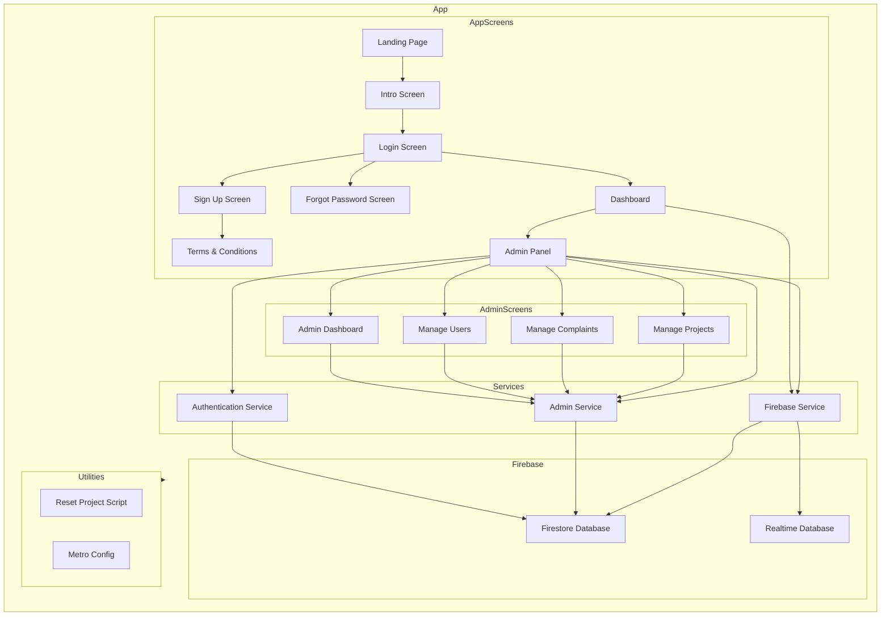

    

    <b>Automatic Architecture Diagrams from Code</b> 
    <a href="https://github.com/swark-io/swark">GitHub</a> • <a href="https://swark.io">Website</a> • <a href="mailto:contact@swark.io">Contact Us</a>

## Usage Instructions

1. **Render the Diagram**: Use the links below to open it in Mermaid Live Editor, or install the [Mermaid Support](https://marketplace.visualstudio.com/items?itemName=bierner.markdown-mermaid) extension.
2. **Recommended Model**: If available for you, use `claude-3.5-sonnet` [language model](vscode://settings/swark.languageModel). It can process more files and generates better diagrams.
3. **Iterate for Best Results**: Language models are non-deterministic. Generate the diagram multiple times and choose the best result.

## Generated Content
**Model**: GPT-4o - [Change Model](vscode://settings/swark.languageModel)  
**Mermaid Live Editor**: [View](https://mermaid.live/view#pako:eNqNlc9u2zAMxl9F0GGn9gVyGNA1KDCgBYKmOc07MDbraLAlQ5I3DEXffZQU_allDz0lH_mTKNL67Dfeqg75jjey1zBd2Mu-kYyZ-Rzk3TQ5_TFybDWiNCHB2CPITsj-AD3-aPhVMScb_jNC36XVKiwkyCsWZAE9ql7IBHlVQ0fRy9OUKCfZaaq5B6V7ZQ9gzB-lu8SHMIvxet0L6tEk3Cv2hd0rassKRW1ndA_mclZQ7J4iBXXXjUIeQOJAgBfMq4Sg7JZDdtRizD6W9k9bbVY8GdSGsCeQ9CiYl0vmXo3TAELaAsyxqgetfmFbsjHyn1aOqH-LFnMbs71cY64HUiitaMHNNsLLwgXve66xB6HxDAYzGSMVXB8xouVmxiodt_H_adAWPJWrPiMMVoy4_0ZkFDVYVzxZMdBtylN5RoOWHriYrN-KVBwuC-Gi7BOSe-hCvorePQqnWJDLkv7H_Sk8ym5vv5Z2dOlC-nRhRL86S59e3Ps1ZM19a1zpZpcvtQcKO7r8orRHssEckVVOZpNsAMEdG8nCERtE8oE_Y3HFwyziHUrLN7OLe_w5IF_Da_0PLedTRifI8g2xnc5tbzOx8RVi62ktOlgbaZ7fSvYT66tzJL-FvPuo8Rs-0tUC0dHX763h9B4aybI71vAOX2EeyHHvBM1TBxb3Asi5I99ZPeMNh9mq41_ZRq3V3F_47hUGg-__ABYcero) | [Edit](https://mermaid.live/edit#pako:eNqNlc9u2zAMxl9F0GGn9gVyGNA1KDCgBYKmOc07MDbraLAlQ5I3DEXffZQU_allDz0lH_mTKNL67Dfeqg75jjey1zBd2Mu-kYyZ-Rzk3TQ5_TFybDWiNCHB2CPITsj-AD3-aPhVMScb_jNC36XVKiwkyCsWZAE9ql7IBHlVQ0fRy9OUKCfZaaq5B6V7ZQ9gzB-lu8SHMIvxet0L6tEk3Cv2hd0rassKRW1ndA_mclZQ7J4iBXXXjUIeQOJAgBfMq4Sg7JZDdtRizD6W9k9bbVY8GdSGsCeQ9CiYl0vmXo3TAELaAsyxqgetfmFbsjHyn1aOqH-LFnMbs71cY64HUiitaMHNNsLLwgXve66xB6HxDAYzGSMVXB8xouVmxiodt_H_adAWPJWrPiMMVoy4_0ZkFDVYVzxZMdBtylN5RoOWHriYrN-KVBwuC-Gi7BOSe-hCvorePQqnWJDLkv7H_Sk8ym5vv5Z2dOlC-nRhRL86S59e3Ps1ZM19a1zpZpcvtQcKO7r8orRHssEckVVOZpNsAMEdG8nCERtE8oE_Y3HFwyziHUrLN7OLe_w5IF_Da_0PLedTRifI8g2xnc5tbzOx8RVi62ktOlgbaZ7fSvYT66tzJL-FvPuo8Rs-0tUC0dHX763h9B4aybI71vAOX2EeyHHvBM1TBxb3Asi5I99ZPeMNh9mq41_ZRq3V3F_47hUGg-__ABYcero)

